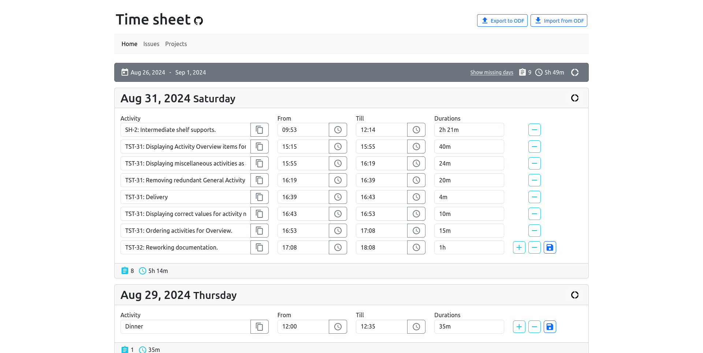

# Timesheet Application

Yet another (serverless) time tracking web application. 



Explore the [online version of the Timesheet App](https://time.e-dreams.lv/).

## Motivation

As a professional Software Developer, I frequently used various commercial time tracking applications, but none provided a comfortable user experience due to numerous UI/UX issues. Ultimately, this led me to create my own time tracking application, designed with a focus on simplicity, usability, and efficiency.

## Goals

1. Make the time tracking task as simple as possible;
2. Make it serverless first. All the data stored in browser;
3. Make it free and open-source;

## Development

Check out the [Roadmap](./docs/roadmap.md) to see what's planned next.

## Prerequisites

* [Node.js and NPM](https://nodejs.org/en)

## Setup

```bash
npm install
npm start
```

## Documentation

* [Roadmap](/docs/roadmap.md)
* [Changelog](./docs/changelog.md)
* [Database](./docs/database.md)
  * [Dexie](./docs/dexie.md)
* Features:
  * [To Do](./docs/todo.md)
  * [Completed](./docs/completed.md)
* Refactoring:
  * [Database Structure](./docs/refactoring/database_structure.md)
* Views
  * [Daily Activities View](./docs/views/daily_activity.md)
  * [Issues View](./docs/views/issues.md)
    * [Accuracy Points](./docs/accuracy_points.md)
  * Projects View
  * Analytics View
