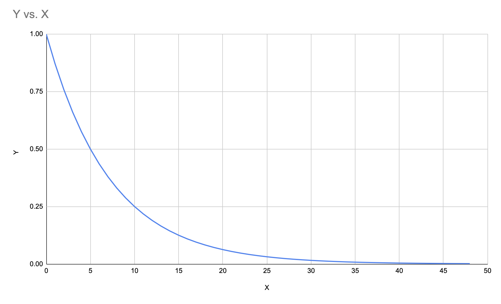

# Accuracy Points

Timesheet application got the possibility to set the time estimations for the Issues. 

That gives the possibility to evaluate the difference between estimated and actual time of development - the Estimation Error.

However, I took a decision to give the evaluation of _Estimation Error_ in some more abstract value, named _Accuracy Points_.

Accuracy Points is the value between `0` for the worst and `1000` for the best case. In other words, if development was estimated for **8 hours**, and took also the **8 hours**, then Estimation Error is **0 hours** and therefore the **Accuracy Point** value will be **1000**;

## Calculation

Some tasks might be estimated to take 30 minutes but end up taking 1 hour of development.

Other tasks might be estimated for 8 hours but take 16 hours of development.

In both cases, the development time was twice the estimated time. However, the Estimation Error in the case of minutes is not as significant as the Estimation Error for hours or days. This is the reason why Accuracy Points are calculated in a non-linear manner.

The calculation of accuracy points is performed in the following steps:

1. Find the Estimated and Actual time in hours;
2. Find the modulus of Estimation Error (`EE`), like `EE = | T_estimated - T_actual |`;
3. Apply the Exponential function to EE: `P = 2^(-EE * 0.2)`;
    - The factor `0.2` moderates the rate of decay;
4. Find the Accuracy Points: `AP = P * 1000`;

### Exponential function

The following exponential function is used to scale the Estimation Error in order to calculate Accuracy Points.

