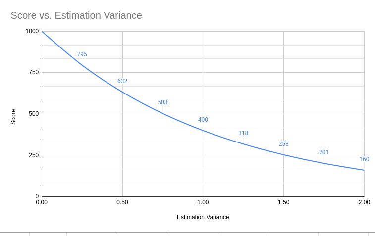

# Accuracy Points

**To be clear: Nobody is good enough with estimation.**

The timesheet application is supporting the time estimates for issues.

This makes it possible to compare the **estimated** development time with the **actual time spent** — the **Estimation Error**.

However, I decided to express the Estimation Error using a more abstract metric called **Accuracy Points**.

**Accuracy Points** is a value between **0** (worst case) and **1000** (best case).

In other words, if a task was estimated at **8 hours** and also took **8 hours**, the **Estimation Error** is **0 hours**, and the **Accuracy Points** value is **1000**.

## Calculation

### Estimation Variance

**Estimation Variance** (EV) answers on question "_How much the estimation was off?_"

$$ EV=\left|\frac{t_{actual}}{t_{estimated}}-1\right| $$

The $t$ is the time in **minutes**.

### Strictness

Strictness is a value (`const`) that answers the question: “_How strict should the penalty be?_”.

The bigger value - the more strict penalty.

I'm used a $Strictness = 2.5$.

### Penalty Multiplier

The **Penalty Multiplier** is calculated using an exponential function: $$ PM=Strictnes^{EV} $$

### Accuracy Points

Accuracy points are calculated as $$ {Accuracy Points} = \frac{1000}{PM} $$

Given that $Strictness = 2.5$, it means that if the **estimation** was **4h** and **actual** time is like **5h**, the score will be around **800** points, which is **good**, while **2x** mistake gives around **400** points and **3x** mistake is around **160**.

