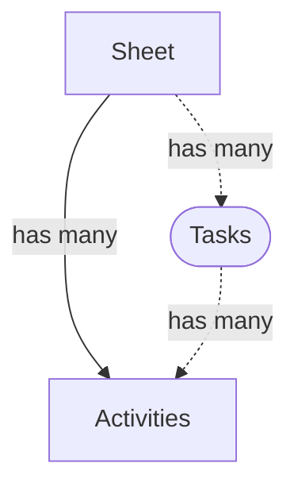

# Database

Timesheet App uses [IndexedDB](https://en.wikipedia.org/wiki/Indexed_Database_API) to store the data and [Dexie.js](https://dexie.org/) lib to access it.

## Entities



### Sheet 

At the moment the Timesheet App have `timesheet` database and `sheet` table.

There is `sheet` records, one **sheet** per **day**.

Sheet have the following fields:

1. `id` - `1`
2. `date` - `2023-01-15`
3. `activities` - `[]`

### Task

Task is some kind of `virtual` entity. Used to group the activities that share the same _Task Number_.

### Activity

Activity is some object within the `sheet` entity, stored in `activities` field.

Activity have the following properties:

1. `name` - `ABC-123: Setup for the project`
2. `from` - `12:00`
3. `till` - `12:45`
4. `duration` - `45m`

#### Task Number

Activity might be associated with some task. In order to do so you should specify activity name according to the following pattern:

```
<task number>: <task description>
```

For example, if some activity has the name like `TSA-456: Make Greeting Text green`, then `TSA-456` is the task number.


