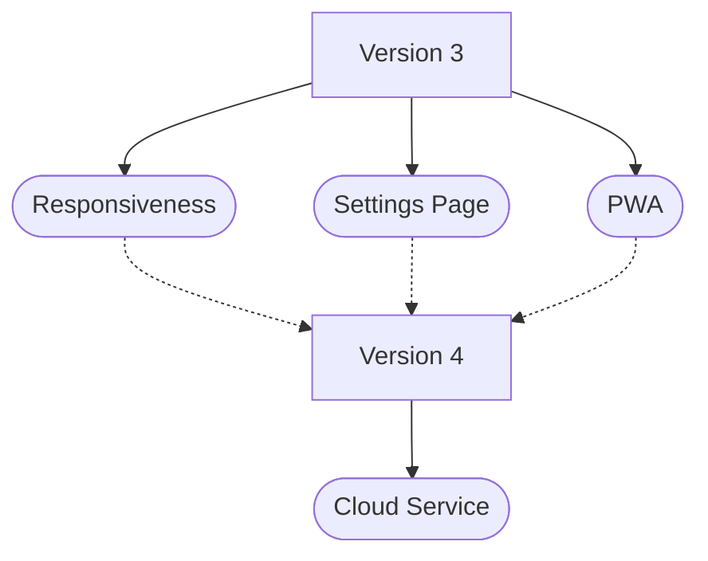

# Roadmap

## Responsiveness

Skipping responsiveness during the initial development was a mistake, and its absence is now greatly felt.

Incorporating responsiveness is crucial for enhancing the overall user experience.

## Settings View

Given the diverse work schedules—part-time, four-day workweeks, and more—it’s essential to make the application configurable.

By allowing customization, the application will better accommodate different work patterns, resulting in more accurate time tracking and reporting.

## Progressive Web Application

Converting the Timesheet Web Application to a PWA (Progressive Web App) will make it more versatile and accessible across different devices.

Ability to install the app on desktops or mobile devices enables offline access and faster load times.

Additionally, the PWA can offer push notifications and a more seamless user experience, similar to a native application, while still being web-based. This enhancement will significantly improve user engagement and convenience.

## Cloud Service

An optional backend application is planned for users who prefer to store their data outside the browser and sync it across multiple devices.

This backend may not only provide seamless data access from any computer but will also offer enhanced reporting and administrative functionality.

These additional features may be particularly beneficial to managers, offering deeper insights and better control over time tracking data.

## Other things

- I'd like to add some option (within the future _Settings_ page or something like that), allowing to round the time values. Like `12:57` to `13:00` or `17:11` to `17:10`;
