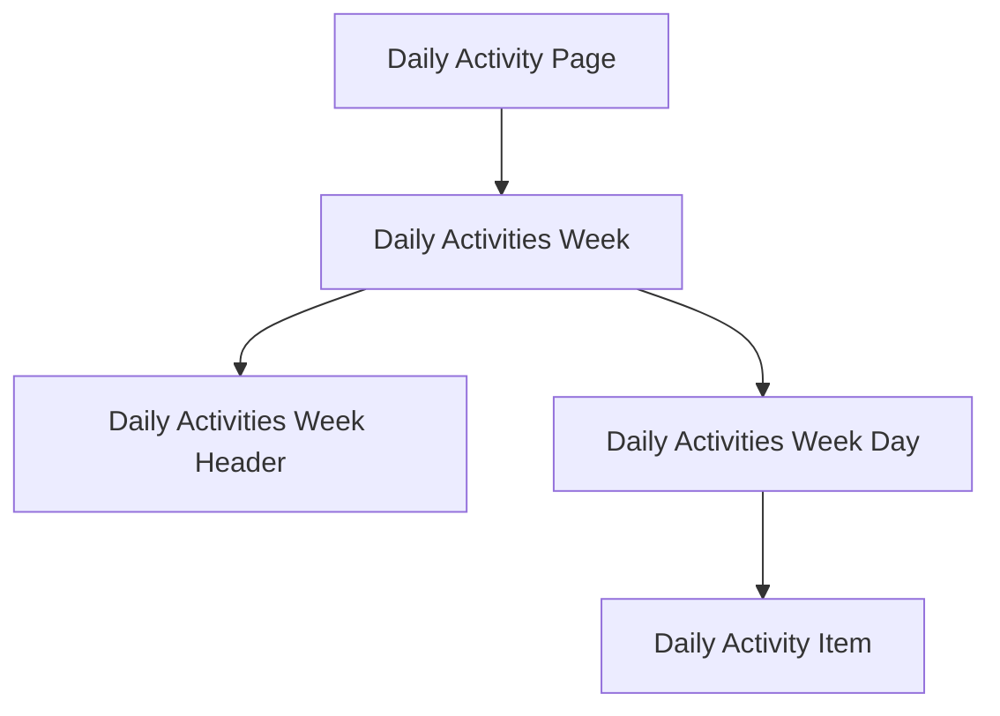

# Daily Activity View

## Structure

- `Daily Activity Item` emits following events:
  - `add` - adds new empty activity to the list
  - `remove` - removes activity from the list
  - `save` - save changes of activity list
- `Daily Activities Week Day` handles events from `Daily Activity Item` and operates on `Activity Form Array`:
  - `add` - push new activity form item to `Activity Form Array`;
  - `remove` - removes activity item from `Activity Form Array` and updates the list of _removable activity ids_;
  - `save` - first it **removes** all removable activities, then updates activity (if existing) or creates a new one;
