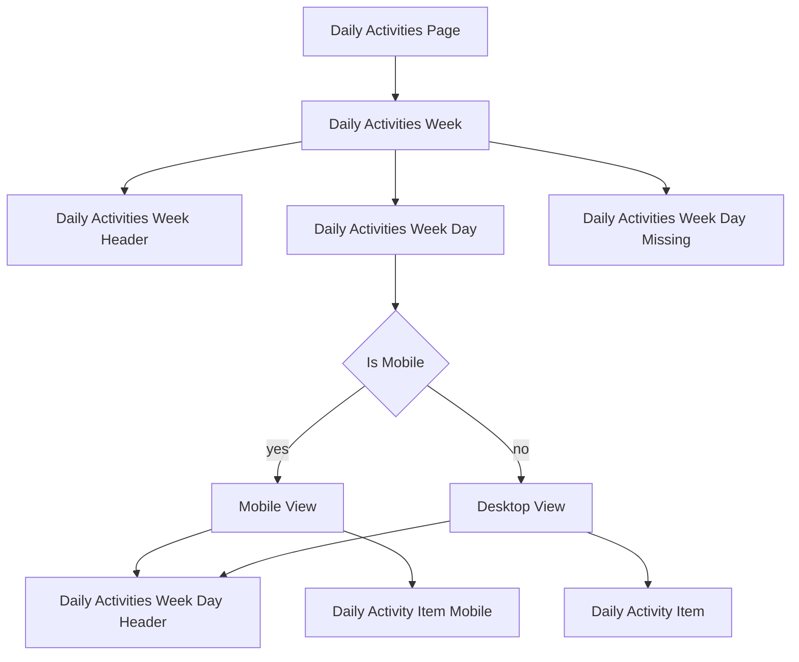

# Daily Activity View

## Structure

## Daily Activity Page

- Mounted through the application Router;
- Running the `infiniteScroll` directive;
- Displays the `daily-activities-week` component for the `Week` objects;

## Daily Activities Week

- Displays the Week Header component;
- If there is some days marked **missing**, then show the `daily-activities-week-day-missing` component;
- Otherwise, show the `daily-activities-week-day` component;
  - On **changes** in `daily-activities-week-day` recalculate the summary of the **week**;

## Daily Activities Week Day

- Switches between **Mobile** and **Desktop** views;
- **Save**, **Add**, **Remove**, **Reset** actions are **occurring in this component**;

### Mobile View

- Displays the `daily-activity-item-mobile`;
- Shows the `daily-activity-item` component, adapted for the mobile views;

### Desktop View

- Displays the `daily-activities-week-day-header`;
- For **Daily Activities**, shows the `daily-activity-item` component;
- And `daily-activities-week-day-footer` component;
