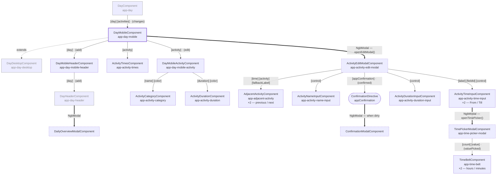

# Day Mobile — Component Tree

The component tree rendered for the mobile version of a single day, starting from
`DayMobileComponent` (`day-mobile.component.ts`).

Notation: `[name]` is an input, `(name)` is an output.

## Edges

| Style | Meaning |
| --- | --- |
| Solid arrow | Template containment — the child sits in the parent's template |
| Thick arrow | Opened imperatively through `NgbModal`, not present in any template |
| Dotted arrow | Class inheritance |
| Grey nodes | Components living outside of `day-mobile/`, drawn for context |

## Notes

- `DayMobileComponent` extends `DayDesktopComponent` and reuses its `FormArray` of
  `ActivityFormGroup`. The desktop template renders the inputs inline for the whole day,
  while the mobile one edits a single activity at a time inside `ActivityEditModalComponent`.
- `ActivityEditModalComponent` is not referenced from `day-mobile.component.html` — it is
  opened by `openEditModal()` and receives its inputs by assignment on
  `modalRef.componentInstance`. Its result (`save` / `remove` / `add` / `cancel`) drives what
  `DayMobileComponent` does next.
- The inputs of the edit modal are bound to the `FormControl`s of the very same
  `ActivityFormGroup` the day holds, so edits are visible to the day before being saved.
- Saving never happens in the modal: it closes with a result, and `DayMobileComponent.save()`
  emits `changes` up to `DayComponent`, which persists and pushes the activities back down.
